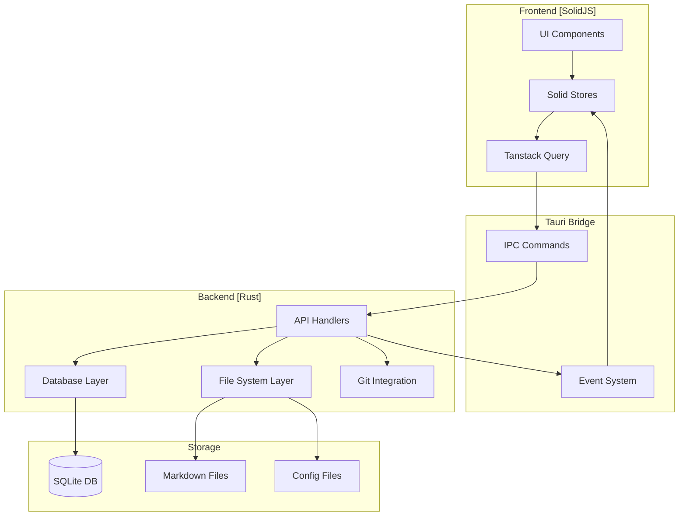

# EvorBrain Planning Document

**Last Updated:** 2025-07-27  
**Version:** 1.0.0  
**Status:** Active Development

---

## Table of Contents

1. [Project Overview](#project-overview)
2. [Core Objectives](#core-objectives)
3. [Architecture Decisions](#architecture-decisions)
4. [System Architecture](#system-architecture)
5. [Database Schema Design](#database-schema-design)
6. [File System Organization](#file-system-organization)
7. [API Design and Data Flow](#api-design-and-data-flow)
8. [Security Considerations](#security-considerations)
9. [Performance Requirements](#performance-requirements)
10. [Extensibility Strategy](#extensibility-strategy)
11. [Technology Stack](#technology-stack)
12. [Development Phases](#development-phases)
13. [Risk Assessment](#risk-assessment)
14. [Decision Log](#decision-log)

---

## Project Overview

EvorBrain is a hybrid desktop/web application that combines the best features of Notion and Obsidian, providing a hierarchical task management system with local file storage, automatic backups, and a powerful dashboard interface.

### What Does This Do?

EvorBrain helps users organize their entire life through a structured hierarchy:

- **Life Areas** (e.g., Career, Health, Finance)
- **Goals** within each life area
- **Projects** to achieve those goals
- **Tasks** and subtasks to complete projects

All data is stored locally in human-readable files (like Obsidian), with automatic git backups and a beautiful, responsive interface powered by modern web technologies.

---

## Core Objectives

### Primary Goals

1. **Local-First Architecture**: All data stored locally with full user control
2. **Hierarchical Organization**: Clear structure from life areas down to subtasks
3. **Automatic Backups**: Git integration for version control and cloud sync
4. **Fast Performance**: Native desktop performance with web flexibility
5. **Beautiful UI**: Modern, responsive interface with calendar views and dashboards

### Secondary Goals

1. **Cross-Platform Support**: Start with Windows, expand to macOS/Linux
2. **Extensibility**: Plugin system for future features
3. **AI Integration**: Intelligent priority setting and suggestions
4. **Advanced Tracking**: Habits, health metrics, and progress visualization

---

## Architecture Decisions

### Decision: Tauri over Electron

**Date:** 2025-07-27  
**Rationale:**

- **Performance**: Tauri uses native WebView2 on Windows, resulting in ~50MB apps vs Electron's ~150MB+
- **Security**: Rust backend provides memory safety and better security isolation
- **Resource Usage**: Lower RAM usage (200-300MB vs Electron's 500MB+)
- **Native APIs**: Better access to OS features through Rust
- **Future-Proof**: Growing ecosystem, excellent TypeScript support

### Decision: SolidJS over React/Vue

**Date:** 2025-07-27  
**Rationale:**

- **Performance**: No virtual DOM, fine-grained reactivity
- **Bundle Size**: ~7KB vs React's ~45KB
- **Simplicity**: Less boilerplate, more intuitive reactivity model
- **TypeScript**: First-class TypeScript support
- **Compatibility**: Works excellently with Vite and modern tooling

### Decision: SQLite + File System Hybrid Storage

**Date:** 2025-07-27  
**Rationale:**

- **SQLite**: Fast queries, ACID compliance, relationships, full-text search
- **File System**: Human-readable markdown files, git-friendly, user accessibility
- **Hybrid Benefits**: Query performance + data portability

---

## System Architecture



### Component Architecture

```
evorbrain/
├── src-tauri/          # Rust backend
│   ├── src/
│   │   ├── main.rs     # Entry point
│   │   ├── commands/   # IPC command handlers
│   │   ├── db/         # Database operations
│   │   ├── storage/    # File system operations
│   │   ├── sync/       # Git synchronization
│   │   └── utils/      # Shared utilities
│   └── Cargo.toml
├── src/                # SolidJS frontend
│   ├── components/     # UI components
│   ├── stores/         # State management
│   ├── hooks/          # Custom hooks
│   ├── api/            # Tauri command wrappers
│   ├── types/          # TypeScript types
│   └── styles/         # Global styles
└── data/               # User data directory
    ├── evorbrain.db    # SQLite database
    ├── areas/          # Life area markdown files
    ├── attachments/    # File attachments
    └── .git/           # Git repository
```

---

## Database Schema Design

### Core Tables

```sql
-- Life Areas (top level)
CREATE TABLE life_areas (
    id TEXT PRIMARY KEY,
    name TEXT NOT NULL,
    description TEXT,
    color TEXT,
    icon TEXT,
    position INTEGER NOT NULL,
    created_at TIMESTAMP DEFAULT CURRENT_TIMESTAMP,
    updated_at TIMESTAMP DEFAULT CURRENT_TIMESTAMP
);

-- Goals
CREATE TABLE goals (
    id TEXT PRIMARY KEY,
    life_area_id TEXT NOT NULL,
    title TEXT NOT NULL,
    description TEXT,
    target_date DATE,
    status TEXT CHECK(status IN ('active', 'completed', 'archived')),
    progress REAL DEFAULT 0,
    created_at TIMESTAMP DEFAULT CURRENT_TIMESTAMP,
    updated_at TIMESTAMP DEFAULT CURRENT_TIMESTAMP,
    FOREIGN KEY (life_area_id) REFERENCES life_areas(id) ON DELETE CASCADE
);

-- Projects
CREATE TABLE projects (
    id TEXT PRIMARY KEY,
    goal_id TEXT NOT NULL,
    title TEXT NOT NULL,
    description TEXT,
    status TEXT CHECK(status IN ('planning', 'active', 'completed', 'archived')),
    priority INTEGER CHECK(priority BETWEEN 1 AND 5),
    start_date DATE,
    end_date DATE,
    created_at TIMESTAMP DEFAULT CURRENT_TIMESTAMP,
    updated_at TIMESTAMP DEFAULT CURRENT_TIMESTAMP,
    FOREIGN KEY (goal_id) REFERENCES goals(id) ON DELETE CASCADE
);

-- Tasks
CREATE TABLE tasks (
    id TEXT PRIMARY KEY,
    project_id TEXT,
    parent_task_id TEXT,
    title TEXT NOT NULL,
    description TEXT,
    status TEXT CHECK(status IN ('todo', 'in_progress', 'completed', 'cancelled')),
    priority INTEGER CHECK(priority BETWEEN 1 AND 5),
    due_date TIMESTAMP,
    completed_at TIMESTAMP,
    estimated_minutes INTEGER,
    actual_minutes INTEGER,
    created_at TIMESTAMP DEFAULT CURRENT_TIMESTAMP,
    updated_at TIMESTAMP DEFAULT CURRENT_TIMESTAMP,
    FOREIGN KEY (project_id) REFERENCES projects(id) ON DELETE CASCADE,
    FOREIGN KEY (parent_task_id) REFERENCES tasks(id) ON DELETE CASCADE
);

-- Tags for flexible categorization
CREATE TABLE tags (
    id TEXT PRIMARY KEY,
    name TEXT UNIQUE NOT NULL,
    color TEXT
);

-- Many-to-many relationships for tags
CREATE TABLE task_tags (
    task_id TEXT,
    tag_id TEXT,
    PRIMARY KEY (task_id, tag_id),
    FOREIGN KEY (task_id) REFERENCES tasks(id) ON DELETE CASCADE,
    FOREIGN KEY (tag_id) REFERENCES tags(id) ON DELETE CASCADE
);

-- File attachments
CREATE TABLE attachments (
    id TEXT PRIMARY KEY,
    entity_type TEXT NOT NULL,
    entity_id TEXT NOT NULL,
    file_path TEXT NOT NULL,
    file_name TEXT NOT NULL,
    file_size INTEGER,
    mime_type TEXT,
    created_at TIMESTAMP DEFAULT CURRENT_TIMESTAMP
);

-- Indexes for performance
CREATE INDEX idx_goals_life_area ON goals(life_area_id);
CREATE INDEX idx_projects_goal ON projects(goal_id);
CREATE INDEX idx_tasks_project ON tasks(project_id);
CREATE INDEX idx_tasks_parent ON tasks(parent_task_id);
CREATE INDEX idx_tasks_due_date ON tasks(due_date);
CREATE INDEX idx_tasks_status ON tasks(status);
```

---

## File System Organization

### Directory Structure

```
data/
├── evorbrain.db                    # Main SQLite database
├── areas/                          # Life area folders
│   ├── career/
│   │   ├── _meta.json             # Area metadata
│   │   ├── goals/
│   │   │   ├── become-senior-dev/
│   │   │   │   ├── _meta.json    # Goal metadata
│   │   │   │   ├── README.md     # Goal description
│   │   │   │   └── projects/
│   │   │   │       └── learn-rust/
│   │   │   │           ├── _meta.json
│   │   │   │           ├── README.md
│   │   │   │           └── tasks.md
│   │   │   └── ...
│   │   └── ...
│   └── ...
├── attachments/                    # Binary files
│   ├── 2025/
│   │   ├── 01/
│   │   │   └── file-uuid.ext
│   │   └── ...
│   └── ...
├── templates/                      # User templates
│   ├── project-template.md
│   └── task-template.md
└── config/
    ├── settings.json              # Application settings
    └── shortcuts.json             # Keyboard shortcuts
```

### File Formats

**\_meta.json** (Area/Goal/Project metadata):

```json
{
  "id": "uuid",
  "type": "area|goal|project",
  "created": "2025-07-27T10:00:00Z",
  "updated": "2025-07-27T10:00:00Z",
  "color": "#3B82F6",
  "icon": "briefcase",
  "tags": ["work", "priority"]
}
```

**tasks.md** (Human-readable task list):

```markdown
# Project: Learn Rust

## Tasks

- [x] Set up development environment
- [x] Complete Rust book chapters 1-3
- [ ] Build CLI todo app
  - [x] Parse command line arguments
  - [ ] Implement storage
  - [ ] Add list/add/remove commands
- [ ] Contribute to open source Rust project
```

---

## API Design and Data Flow

### Tauri Commands (IPC)

```typescript
// Life Area Commands
interface LifeAreaCommands {
  create_life_area: (name: string, description?: string) => LifeArea;
  get_life_areas: () => LifeArea[];
  update_life_area: (id: string, updates: Partial<LifeArea>) => LifeArea;
  delete_life_area: (id: string) => void;
  reorder_life_areas: (ids: string[]) => void;
}

// Goal Commands
interface GoalCommands {
  create_goal: (lifeAreaId: string, goal: NewGoal) => Goal;
  get_goals: (lifeAreaId?: string) => Goal[];
  update_goal: (id: string, updates: Partial<Goal>) => Goal;
  delete_goal: (id: string) => void;
  calculate_goal_progress: (id: string) => number;
}

// Project Commands
interface ProjectCommands {
  create_project: (goalId: string, project: NewProject) => Project;
  get_projects: (goalId?: string) => Project[];
  update_project: (id: string, updates: Partial<Project>) => Project;
  delete_project: (id: string) => void;
  move_project: (id: string, newGoalId: string) => Project;
}

// Task Commands
interface TaskCommands {
  create_task: (projectId: string, task: NewTask) => Task;
  get_tasks: (filters: TaskFilters) => Task[];
  update_task: (id: string, updates: Partial<Task>) => Task;
  delete_task: (id: string) => void;
  complete_task: (id: string) => Task;
  create_subtask: (parentId: string, task: NewTask) => Task;
  get_calendar_tasks: (start: Date, end: Date) => CalendarTask[];
}

// Sync Commands
interface SyncCommands {
  init_git_repo: (remote?: string) => void;
  commit_changes: (message?: string) => void;
  push_changes: () => void;
  pull_changes: () => void;
  get_sync_status: () => SyncStatus;
}
```

### Data Flow Patterns

1. **Command Pattern**: Frontend sends commands through Tauri IPC
2. **Event System**: Backend emits events for data changes
3. **Optimistic Updates**: UI updates immediately, rolls back on error
4. **Background Sync**: Periodic git commits and pushes

```typescript
// Frontend data flow example
const createTask = async (projectId: string, task: NewTask) => {
  // Optimistic update
  queryClient.setQueryData(["tasks", projectId], (old) => [...old, tempTask]);

  try {
    const newTask = await invoke("create_task", { projectId, task });
    // Update with real data
    queryClient.setQueryData(["tasks", projectId], (old) =>
      old.map((t) => (t.id === tempTask.id ? newTask : t))
    );
  } catch (error) {
    // Rollback on error
    queryClient.invalidateQueries(["tasks", projectId]);
    throw error;
  }
};
```

---

## Security Considerations

### Application Security

1. **File System Access**

   - Restrict file operations to app data directory
   - Validate all file paths to prevent directory traversal
   - Use Tauri's allowlist for command permissions

2. **Database Security**

   - Use parameterized queries (SQLite prepared statements)
   - Encrypt sensitive data at rest (future feature)
   - Regular database backups

3. **Git Integration**

   - Store credentials in system keychain
   - Use SSH keys over HTTPS when possible
   - Validate remote URLs before operations

4. **Input Validation**
   - Sanitize all user inputs
   - Validate data types and formats
   - Implement rate limiting for commands

### Code Security

```rust
// Example: Safe file path handling
use std::path::{Path, PathBuf};

fn validate_file_path(requested: &str, base_dir: &Path) -> Result<PathBuf> {
    let path = base_dir.join(requested);
    let canonical = path.canonicalize()?;

    // Ensure path is within base directory
    if !canonical.starts_with(base_dir) {
        return Err(Error::InvalidPath);
    }

    Ok(canonical)
}
```

---

## Performance Requirements

### Target Metrics

| Metric                    | Target  | Critical |
| ------------------------- | ------- | -------- |
| Application startup       | < 2s    | < 5s     |
| Task creation             | < 100ms | < 500ms  |
| Search (1000 items)       | < 200ms | < 1s     |
| Calendar view load        | < 300ms | < 1s     |
| File sync (100 files)     | < 5s    | < 30s    |
| Memory usage              | < 200MB | < 500MB  |
| Database size (10k tasks) | < 50MB  | < 200MB  |

### Optimization Strategies

1. **Database**

   - Use indexes on frequently queried columns
   - Implement query result caching
   - Batch operations where possible
   - Use full-text search for content

2. **Frontend**

   - Virtual scrolling for large lists
   - Lazy load components
   - Debounce search inputs
   - Memoize expensive computations

3. **File Operations**
   - Async I/O for all file operations
   - Queue and batch git operations
   - Cache frequently accessed files
   - Use file watchers for change detection

---

## Extensibility Strategy

### Plugin Architecture (Future)

```typescript
interface Plugin {
  id: string;
  name: string;
  version: string;
  hooks: {
    onTaskCreate?: (task: Task) => Task;
    onTaskComplete?: (task: Task) => void;
    registerCommands?: () => Command[];
    registerViews?: () => ViewComponent[];
  };
}
```

### Extension Points

1. **Custom Views**: Register new dashboard widgets
2. **Data Processors**: Transform data on save/load
3. **Integrations**: Connect external services
4. **Themes**: Custom UI themes and styles
5. **Commands**: Add new keyboard commands

### Future Features Architecture

**AI Integration**

- Separate AI module with provider abstraction
- Local LLM support (Ollama)
- Cloud provider options (OpenAI, Anthropic)
- Priority suggestion API

**Habit Tracker**

- New database tables for habits and tracking
- Streak calculation service
- Integration with task system
- Visual habit charts

**Health Tracker**

- Modular health metric system
- Integration with wearables API
- Data visualization components
- Correlation analysis with productivity

---

## Technology Stack

### Core Technologies

| Layer            | Technology     | Version   | Alternatives Considered      |
| ---------------- | -------------- | --------- | ---------------------------- |
| Desktop          | Tauri          | 2.0       | Electron, Wails, Flutter     |
| Frontend         | SolidJS        | 1.8       | React, Vue, Svelte           |
| Styling          | Tailwind CSS   | 3.4       | CSS Modules, Emotion, UnoCSS |
| UI Components    | Kobalte        | 0.9       | Headless UI, Radix, Custom   |
| Build Tool       | Vite + Bun     | 5.0 + 1.0 | Webpack, Rollup, esbuild     |
| Language         | TypeScript     | 5.3       | JavaScript, ReScript         |
| Backend Language | Rust           | 1.75      | Go, C++, Zig                 |
| Database         | SQLite         | 3.44      | PostgreSQL, DuckDB           |
| State Management | Solid Stores   | -         | Zustand, Valtio, Jotai       |
| Data Fetching    | Tanstack Query | 5.0       | SWR, Custom hooks            |

### Development Tools

- **Linting**: ESLint + Biome
- **Formatting**: Prettier
- **Testing**: Vitest + Testing Library
- **E2E Testing**: Playwright
- **Git Hooks**: Husky + lint-staged
- **CI/CD**: GitHub Actions

---

## Development Phases

### Phase 1: Foundation (Complexity: Low)

- [x] Project setup and configuration
- [ ] Basic Tauri + SolidJS integration
- [ ] Core database schema implementation
- [ ] File system structure setup
- [ ] Basic CRUD operations for all entities
- [ ] Simple task list UI

### Phase 2: Core Features (Complexity: Medium)

- [ ] Hierarchical navigation UI
- [ ] Task management with subtasks
- [ ] Calendar view implementation
- [ ] Priority system
- [ ] Basic search functionality
- [ ] Markdown file generation

### Phase 3: Sync & Backup (Complexity: Medium)

- [ ] Git repository initialization
- [ ] Automatic commit system
- [ ] Remote push/pull functionality
- [ ] Conflict resolution UI
- [ ] Backup scheduling

### Phase 4: Dashboard & Polish (Complexity: Medium)

- [ ] Overview dashboard design
- [ ] Progress tracking visualizations
- [ ] Keyboard shortcuts
- [ ] Settings and preferences
- [ ] Performance optimization
- [ ] Beta testing

### Phase 5: Advanced Features (Complexity: High)

- [ ] AI priority suggestions
- [ ] Habit tracker module
- [ ] Health metrics integration
- [ ] Progress graphing
- [ ] Template system
- [ ] Plugin architecture

### Phase 6: Cross-Platform (Complexity: High)

- [ ] macOS support and testing
- [ ] Linux support and testing
- [ ] Mobile companion app planning
- [ ] Cloud sync option
- [ ] Public release preparation

---

## Risk Assessment

### Technical Risks

| Risk                                          | Probability | Impact   | Mitigation Strategy                                                      |
| --------------------------------------------- | ----------- | -------- | ------------------------------------------------------------------------ |
| SQLite performance issues with large datasets | Medium      | High     | Implement pagination, indexes, and consider migration path to PostgreSQL |
| Tauri 2.0 stability issues                    | Low         | High     | Monitor Tauri releases, maintain fallback to stable version              |
| Git conflicts in automated sync               | Medium      | Medium   | Implement robust conflict detection and user-friendly resolution UI      |
| File system corruption                        | Low         | Critical | Regular backups, atomic writes, integrity checks                         |
| Cross-platform compatibility                  | Medium      | Medium   | Early testing on all platforms, CI/CD for each OS                        |

### Business Risks

| Risk                               | Probability | Impact | Mitigation Strategy                                         |
| ---------------------------------- | ----------- | ------ | ----------------------------------------------------------- |
| User adoption challenges           | Medium      | High   | Focus on UX, provide migration tools from other apps        |
| Competition from established tools | High        | Medium | Differentiate with local-first approach and unique features |
| Scope creep                        | High        | Medium | Strict phase planning, MVP focus                            |
| Maintenance burden                 | Medium      | Medium | Modular architecture, comprehensive testing                 |

---

## Decision Log

### 2025-07-27: Initial Architecture Decisions

- Chose Tauri 2.0 for performance and security benefits
- Selected SolidJS for its fine-grained reactivity
- Decided on SQLite + file system hybrid approach
- Established hierarchical data model

### Future Decisions Pending

- [ ] Exact markdown format for task files
- [ ] Plugin API design
- [ ] Mobile app technology choice
- [ ] Cloud sync provider selection
- [ ] Licensing model

---

## Deployment and Infrastructure

### Desktop Application

1. **Build Process**

   - GitHub Actions for CI/CD
   - Code signing for Windows/macOS
   - Auto-updater integration
   - Installer generation (MSI/DMG/AppImage)

2. **Distribution**

   - GitHub Releases for direct downloads
   - Microsoft Store (Windows)
   - Future: Mac App Store, Linux package managers

3. **Update Mechanism**
   - Built-in auto-updater using Tauri
   - Differential updates to minimize bandwidth
   - Rollback capability for failed updates

### Support Infrastructure

1. **Documentation Site**

   - Static site with usage guides
   - API documentation for plugins
   - Video tutorials

2. **Community**
   - GitHub Discussions for support
   - Discord server for real-time help
   - Feature request tracking

---

## Conclusion

This planning document establishes the foundation for EvorBrain's development. The architecture prioritizes local-first principles, performance, and extensibility while maintaining a beautiful user experience. Regular updates to this document will track decisions and evolving requirements throughout the development lifecycle.

### Next Steps

1. Set up development environment
2. Initialize project structure
3. Implement Phase 1 foundation
4. Create initial UI mockups
5. Begin development blog/documentation

**Document Status**: This is a living document that will be updated as the project evolves.
