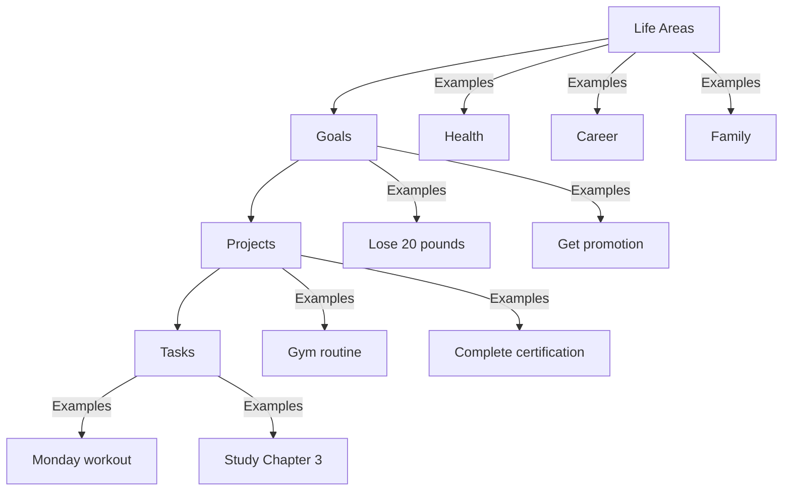
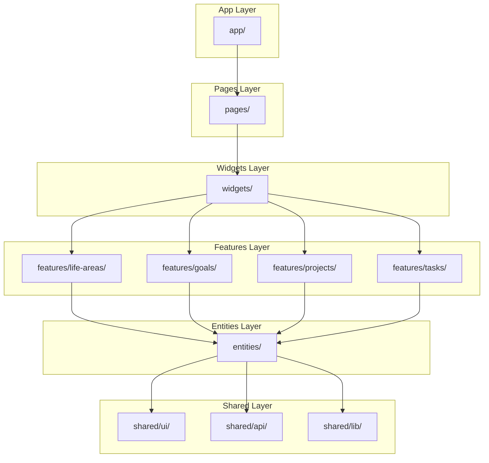
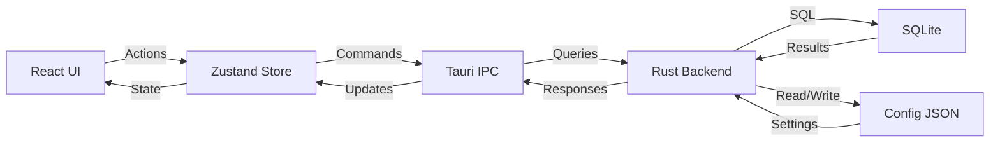
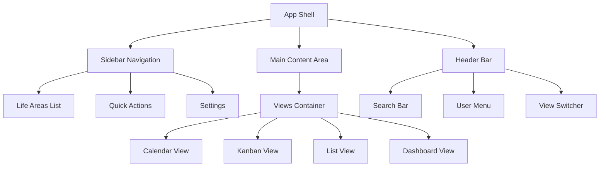

# EvorBrain Planning Document

**Document Version:** 1.2  
**Last Updated:** 2025-07-18  
**Project Status:** Development Phase - MVP Week 1

---

## Table of Contents

1. [Project Overview & Vision](#project-overview--vision)
2. [Architecture Decisions](#architecture-decisions)
3. [Database Schema Design](#database-schema-design)
4. [UI/UX Design System](#uiux-design-system)
5. [Development Phases](#development-phases)
6. [Technical Constraints & Assumptions](#technical-constraints--assumptions)
7. [Risk Assessment & Mitigation](#risk-assessment--mitigation)
8. [Decision Log](#decision-log)

---

## Project Overview & Vision

### Project Scope

EvorBrain is a personal productivity system that helps users organize their life through a hierarchical structure of Life Areas, Goals, Projects, and Tasks. The application focuses on providing a clear, intuitive interface for managing personal productivity with calendar integration and visual organization tools.

### Core Objectives

- **Hierarchical Organization**: Enable users to structure their life from high-level areas down to actionable tasks
- **Visual Management**: Provide calendar views, drag-and-drop interfaces, and clear visual hierarchies
- **Offline-First**: Ensure full functionality without internet connectivity
- **Cross-Platform**: Support Windows, macOS, and Linux through Tauri
- **Performance**: Maintain fast, responsive interactions even with large datasets

### Core Workflow


```mermaid
graph TD
    A[Life Areas] --> B[Goals]
    B --> C[Projects]
    C --> D[Tasks]

    A -->|Examples| A1[Health]
    A -->|Examples| A2[Career]
    A -->|Examples| A3[Family]

    B -->|Examples| B1[Lose 20 pounds]
    B -->|Examples| B2[Get promotion]

    C -->|Examples| C1[Gym routine]
    C -->|Examples| C2[Complete certification]

    D -->|Examples| D1[Monday workout]
    D -->|Examples| D2[Study Chapter 3]
```

---

## Architecture Decisions

### Tech Stack Overview

| Layer              | Technology              | Rationale                                                     |
| ------------------ | ----------------------- | ------------------------------------------------------------- |
| Desktop Framework  | Tauri                   | Lightweight, secure, native performance with web technologies |
| Frontend Framework | React + TypeScript      | Type safety, component reusability, large ecosystem           |
| UI Components      | Radix UI + Tailwind CSS | Accessible primitives + utility-first styling                 |
| State Management   | Zustand                 | Simple, performant, TypeScript-friendly                       |
| Data Storage       | SQLite + JSON           | Relational data integrity + flexible config storage           |
| Build Tool         | Vite                    | Fast HMR, optimized builds, excellent DX                      |
| Calendar           | FullCalendar            | Feature-rich, customizable, good React integration            |
| Drag & Drop        | @dnd-kit                | Modern, accessible, performant                                |

### Architecture Pattern: Feature-Sliced Design


```mermaid
graph TB
    subgraph App Layer
        A[app/]
    end

    subgraph Pages Layer
        P[pages/]
    end

    subgraph Widgets Layer
        W[widgets/]
    end

    subgraph Features Layer
        F1[features/life-areas/]
        F2[features/goals/]
        F3[features/projects/]
        F4[features/tasks/]
    end

    subgraph Entities Layer
        E[entities/]
    end

    subgraph Shared Layer
        S1[shared/ui/]
        S2[shared/api/]
        S3[shared/lib/]
    end

    A --> P --> W --> F1 & F2 & F3 & F4 --> E --> S1 & S2 & S3
```

### Data Flow Architecture


```mermaid
graph LR
    UI[React UI] -->|Actions| Z[Zustand Store]
    Z -->|Commands| T[Tauri IPC]
    T -->|Queries| R[Rust Backend]
    R -->|SQL| DB[SQLite]
    R -->|Read/Write| C[Config JSON]

    DB -->|Results| R
    C -->|Settings| R
    R -->|Responses| T
    T -->|Updates| Z
    Z -->|State| UI
```

### Key Architectural Decisions

1. **Tauri over Electron**

   - **Decision**: Use Tauri for desktop framework
   - **Rationale**:
     - Smaller bundle size (MB vs GB)
     - Better memory usage
     - Native performance
     - Strong security model
   - **Trade-offs**: Smaller community, newer ecosystem

2. **SQLite for Primary Storage**

   - **Decision**: Use SQLite for structured data, JSON for configs
   - **Rationale**:
     - ACID compliance for data integrity
     - Complex queries for filtering/reporting
     - Embedded database (no server needed)
     - JSON for flexible user preferences
   - **Trade-offs**: Limited concurrent writes (acceptable for single-user app)

3. **Zustand over Redux**
   - **Decision**: Use Zustand for state management
   - **Rationale**:
     - Minimal boilerplate
     - TypeScript inference works well
     - Small bundle size
     - Simpler mental model
   - **Trade-offs**: Less ecosystem, fewer dev tools

---

## Database Schema Design

### SQLite Schema

```sql
-- Life Areas table
CREATE TABLE life_areas (
    id TEXT PRIMARY KEY,
    name TEXT NOT NULL,
    description TEXT,
    color TEXT NOT NULL,
    icon TEXT,
    sort_order INTEGER NOT NULL DEFAULT 0,
    created_at TIMESTAMP DEFAULT CURRENT_TIMESTAMP,
    updated_at TIMESTAMP DEFAULT CURRENT_TIMESTAMP
);

-- Goals table
CREATE TABLE goals (
    id TEXT PRIMARY KEY,
    life_area_id TEXT NOT NULL,
    name TEXT NOT NULL,
    description TEXT,
    target_date DATE,
    status TEXT CHECK(status IN ('active', 'completed', 'paused', 'cancelled')) DEFAULT 'active',
    progress INTEGER DEFAULT 0,
    created_at TIMESTAMP DEFAULT CURRENT_TIMESTAMP,
    updated_at TIMESTAMP DEFAULT CURRENT_TIMESTAMP,
    FOREIGN KEY (life_area_id) REFERENCES life_areas(id) ON DELETE CASCADE
);

-- Projects table
CREATE TABLE projects (
    id TEXT PRIMARY KEY,
    goal_id TEXT NOT NULL,
    name TEXT NOT NULL,
    description TEXT,
    start_date DATE,
    due_date DATE,
    status TEXT CHECK(status IN ('planning', 'active', 'completed', 'on_hold', 'cancelled')) DEFAULT 'planning',
    progress INTEGER DEFAULT 0,
    created_at TIMESTAMP DEFAULT CURRENT_TIMESTAMP,
    updated_at TIMESTAMP DEFAULT CURRENT_TIMESTAMP,
    FOREIGN KEY (goal_id) REFERENCES goals(id) ON DELETE CASCADE
);

-- Tasks table
CREATE TABLE tasks (
    id TEXT PRIMARY KEY,
    project_id TEXT NOT NULL,
    name TEXT NOT NULL,
    description TEXT,
    due_date TIMESTAMP,
    completed_at TIMESTAMP,
    priority TEXT CHECK(priority IN ('low', 'medium', 'high', 'critical')) DEFAULT 'medium',
    status TEXT CHECK(status IN ('todo', 'in_progress', 'completed', 'cancelled')) DEFAULT 'todo',
    estimated_minutes INTEGER,
    actual_minutes INTEGER,
    recurrence_rule TEXT, -- iCal RRULE format
    created_at TIMESTAMP DEFAULT CURRENT_TIMESTAMP,
    updated_at TIMESTAMP DEFAULT CURRENT_TIMESTAMP,
    FOREIGN KEY (project_id) REFERENCES projects(id) ON DELETE CASCADE
);

-- Tags table (for future expansion)
CREATE TABLE tags (
    id TEXT PRIMARY KEY,
    name TEXT NOT NULL UNIQUE,
    color TEXT NOT NULL,
    created_at TIMESTAMP DEFAULT CURRENT_TIMESTAMP
);

-- Task tags junction table
CREATE TABLE task_tags (
    task_id TEXT NOT NULL,
    tag_id TEXT NOT NULL,
    PRIMARY KEY (task_id, tag_id),
    FOREIGN KEY (task_id) REFERENCES tasks(id) ON DELETE CASCADE,
    FOREIGN KEY (tag_id) REFERENCES tags(id) ON DELETE CASCADE
);

-- Indexes for performance
CREATE INDEX idx_goals_life_area ON goals(life_area_id);
CREATE INDEX idx_projects_goal ON projects(goal_id);
CREATE INDEX idx_tasks_project ON tasks(project_id);
CREATE INDEX idx_tasks_due_date ON tasks(due_date);
CREATE INDEX idx_tasks_status ON tasks(status);
```

### JSON Configuration Structure

```json
{
  "version": "1.0.0",
  "user_preferences": {
    "theme": "light",
    "language": "en",
    "timezone": "UTC",
    "date_format": "YYYY-MM-DD",
    "time_format": "24h",
    "week_starts_on": "monday",
    "default_view": "calendar"
  },
  "ui_settings": {
    "sidebar_collapsed": false,
    "show_completed_tasks": true,
    "calendar_view": "month",
    "task_density": "comfortable",
    "enable_animations": true
  },
  "productivity_settings": {
    "work_hours": {
      "start": "09:00",
      "end": "17:00"
    },
    "pomodoro_duration": 25,
    "break_duration": 5,
    "long_break_duration": 15,
    "daily_task_limit": 10
  },
  "sync_settings": {
    "auto_backup": true,
    "backup_frequency": "daily",
    "backup_location": "./backups"
  }
}
```

---

## UI/UX Design System

### Component Hierarchy


```mermaid
graph TD
    A[App Shell] --> B[Sidebar Navigation]
    A --> C[Main Content Area]
    A --> D[Header Bar]

    B --> B1[Life Areas List]
    B --> B2[Quick Actions]
    B --> B3[Settings]

    C --> C1[Views Container]
    C1 --> V1[Calendar View]
    C1 --> V2[Kanban View]
    C1 --> V3[List View]
    C1 --> V4[Dashboard View]

    D --> D1[Search Bar]
    D --> D2[User Menu]
    D --> D3[View Switcher]
```

### Design Tokens

```typescript
// Color System
const colors = {
  primary: {
    50: "#eff6ff",
    500: "#3b82f6",
    900: "#1e3a8a",
  },
  gray: {
    50: "#f9fafb",
    500: "#6b7280",
    900: "#111827",
  },
  semantic: {
    success: "#10b981",
    warning: "#f59e0b",
    error: "#ef4444",
    info: "#3b82f6",
  },
};

// Spacing System
const spacing = {
  xs: "0.25rem", // 4px
  sm: "0.5rem", // 8px
  md: "1rem", // 16px
  lg: "1.5rem", // 24px
  xl: "2rem", // 32px
  "2xl": "3rem", // 48px
};

// Typography Scale
const typography = {
  xs: "0.75rem", // 12px
  sm: "0.875rem", // 14px
  base: "1rem", // 16px
  lg: "1.125rem", // 18px
  xl: "1.25rem", // 20px
  "2xl": "1.5rem", // 24px
  "3xl": "1.875rem", // 30px
};
```

### Component Library Structure

```
src/shared/ui/
├── primitives/
│   ├── Button/
│   ├── Input/
│   ├── Card/
│   ├── Dialog/
│   └── Dropdown/
├── composite/
│   ├── TaskCard/
│   ├── GoalProgress/
│   ├── LifeAreaTile/
│   └── CalendarEvent/
└── layouts/
    ├── PageLayout/
    ├── SplitView/
    └── GridLayout/
```

### Accessibility Considerations

- **WCAG 2.1 AA Compliance**: All interactive elements meet contrast requirements
- **Keyboard Navigation**: Full app navigation without mouse
- **Screen Reader Support**: Semantic HTML and ARIA labels
- **Focus Management**: Clear focus indicators and logical tab order
- **Reduced Motion**: Respect prefers-reduced-motion settings

---

## Development Phases

### Phase 1: MVP (Weeks 1-6)

**Goal**: Basic functional productivity system

- [x] **Week 1-2**: Project Setup & Core Infrastructure (Completed)

  - [x] Tauri project initialization
  - [x] React + TypeScript setup (with strict mode and path aliases)
  - [x] SQLite integration with migrations
  - [x] Basic routing
  - [x] Complete backend CRUD operations
  - [x] Tauri IPC commands implementation
  - [x] Application startup issues fixed

- [ ] **Week 3-4**: Core CRUD Operations

  - Life Areas management
  - Goals creation and linking
  - Projects under goals
  - Tasks under projects

- [ ] **Week 5**: Calendar Integration

  - FullCalendar setup
  - Task visualization on calendar
  - Basic drag-and-drop

- [ ] **Week 6**: Polish & Testing
  - Basic UI/UX improvements
  - Error handling
  - Initial testing

### Phase 2: Enhanced Features (Weeks 7-12)

**Goal**: Advanced productivity features

- [ ] **Week 7-8**: Advanced Task Management

  - Recurring tasks (RRULE)
  - Task dependencies
  - Bulk operations
  - Advanced filtering

- [ ] **Week 9-10**: Views & Visualization

  - Kanban board view
  - List view with grouping
  - Dashboard with charts
  - Progress tracking

- [ ] **Week 11-12**: Productivity Tools
  - Pomodoro timer
  - Time tracking
  - Daily/weekly reviews
  - Quick capture

### Phase 3: Future Expansion (Months 4-6)

**Goal**: Comprehensive productivity ecosystem

- **Habits Module**

  - Habit tracking
  - Streak visualization
  - Habit stacking

- **Notes & Knowledge**

  - Markdown notes
  - Note linking
  - Full-text search

- **Analytics & Insights**

  - Productivity graphs
  - Goal progress reports
  - Time analysis

- **Sync & Backup**
  - Cloud backup
  - Multi-device sync
  - Export capabilities

---

## Technical Constraints & Assumptions

### Performance Requirements

- **Startup Time**: < 2 seconds cold start
- **Response Time**: < 100ms for user interactions
- **Memory Usage**: < 200MB baseline
- **Database Size**: Support up to 100,000 tasks
- **Render Performance**: 60 FPS for animations

### Platform Constraints

- **Operating Systems**: Windows 10+, macOS 10.15+, Ubuntu 20.04+
- **Screen Resolution**: Minimum 1280x720
- **Storage**: 100MB installation, 500MB data
- **Offline Operation**: Full functionality without internet

### Technical Assumptions

1. **Single User**: No multi-user or collaboration features initially
2. **Local Storage**: All data stored locally, no cloud dependency
3. **English First**: i18n structure but English-only for MVP
4. **Desktop Only**: No mobile app in initial phases
5. **Modern Hardware**: Assume relatively modern CPUs (2015+)

---

## Risk Assessment & Mitigation

### Technical Risks

| Risk                                   | Impact | Probability | Mitigation Strategy                                  |
| -------------------------------------- | ------ | ----------- | ---------------------------------------------------- |
| Tauri ecosystem limitations            | High   | Medium      | Maintain abstraction layer, contribute to ecosystem  |
| SQLite performance with large datasets | Medium | Low         | Implement pagination, indexing, data archival        |
| Calendar library compatibility         | Medium | Medium      | Create adapter pattern, have fallback implementation |
| State management complexity            | Medium | Medium      | Keep store flat, implement clear patterns            |
| Cross-platform UI inconsistencies      | Low    | High        | Extensive testing, platform-specific adjustments     |

### Scalability Considerations

1. **Data Growth**

   - Implement data archival for old completed tasks
   - Use database indexes strategically
   - Consider data pagination in UI

2. **Feature Creep**

   - Maintain clear MVP scope
   - Use feature flags for experimental features
   - Regular user feedback cycles

3. **Performance Degradation**
   - Implement performance monitoring
   - Regular profiling during development
   - Lazy loading for heavy components

---

## Security Architecture

### Security Principles

1. **Defense in Depth**: Multiple layers of security controls
2. **Least Privilege**: Minimal permissions for all operations
3. **Input Validation**: All user input validated and sanitized
4. **Secure by Default**: Security features enabled by default

### Implemented Security Measures

#### Path Traversal Protection
- **Module**: `src-tauri/src/database/path_security.rs`
- **Features**:
  - Canonical path resolution to prevent `../` attacks
  - Absolute path rejection
  - Filename validation (no directory separators)
  - Windows reserved name checking (CON, PRN, etc.)
  - Null byte prevention
- **Integration**: All file operations validate paths through this module

#### SQL Injection Prevention
- **Implementation**: All database queries use parameterized statements
- **Validation**: No dynamic SQL construction allowed
- **Audit**: Regular security audits of all queries

#### Input Validation Layer
- **Module**: `src-tauri/src/validation/`
- **Features**:
  - Comprehensive DTO validation using validator crate
  - Custom ValidationError types with field-level errors
  - Regex patterns for hex colors and safe text validation
  - UUID format validation
  - Date range validation (not too far in past/future)
  - Progress percentage validation (0-100)
  - RRULE format validation for recurring tasks
  - Standardized error messages via AppError enum

#### Tauri Security Configuration
- **CSP Headers**: Restrictive Content Security Policy
- **Freeze Prototype**: Prevents prototype pollution attacks
- **Command Allowlist**: Only explicitly allowed commands can be invoked
- **Asset CSP**: Not disabled for production builds

### Future Security Enhancements

1. **Additional Input Sanitization**
   - XSS prevention for user-generated content
   - HTML sanitization for rich text fields
   - File upload validation and scanning

2. **Encryption at Rest**
   - Optional database encryption
   - Secure key storage
   - Encrypted backups

3. **Audit Logging**
   - Security event logging
   - Failed authentication attempts
   - Data access logging

---

## Decision Log

### 2025-07-15: Initial Architecture Decisions

- **Decision**: Adopt Tauri + React + SQLite stack
- **Rationale**: Best balance of performance, developer experience, and user experience
- **Alternatives Considered**:
  - Electron (too heavy)
  - Native development (too slow)
  - Web-only (no offline capability)

### 2025-07-15: Feature-Sliced Design Adoption

- **Decision**: Use FSD for frontend architecture
- **Rationale**: Clear separation of concerns, scalable structure, prevents coupling
- **Alternatives Considered**:
  - Traditional MVC (less suitable for modern React)
  - Atomic Design (more complex for this use case)

### 2025-07-15: Local-First Data Strategy

- **Decision**: All data stored locally with optional sync
- **Rationale**: Privacy, performance, offline capability
- **Trade-offs**: No built-in collaboration, manual backup needed

### 2025-07-15: Calendar Library Selection

- **Decision**: Use FullCalendar for calendar views
- **Rationale**: Most features, good React integration, active development
- **Alternatives Considered**:
  - React Big Calendar (less features)
  - Custom implementation (too time-consuming)

---

**Next Steps**:

1. Review and approve this planning document
2. Set up development environment
3. Create initial project structure
4. Begin Phase 1 implementation

**Document Maintenance**: This document should be updated whenever major architectural decisions are made or requirements change significantly.
