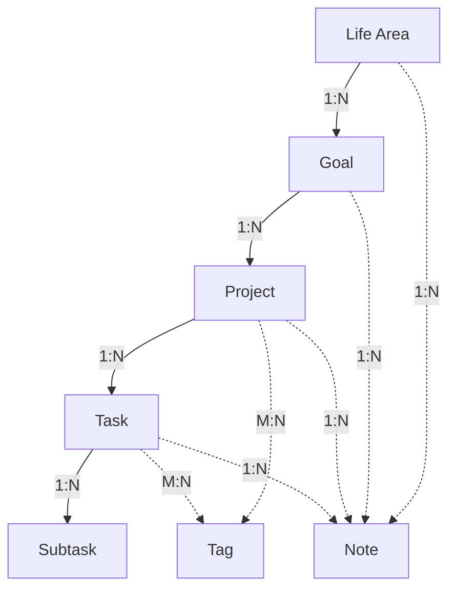

# EvorBrain Business Logic Documentation

This document outlines the complex business logic patterns and architectural decisions in the
EvorBrain application. Understanding these patterns is crucial for maintaining consistency and
extending the application.

## Table of Contents

1. [Data Model Hierarchy](#data-model-hierarchy)
2. [Repository Pattern](#repository-pattern)
3. [Cascading Operations](#cascading-operations)
4. [State Management](#state-management)
5. [Migration System](#migration-system)
6. [Error Handling Strategy](#error-handling-strategy)
7. [Transaction Management](#transaction-management)
8. [Business Rules](#business-rules)

## Data Model Hierarchy

EvorBrain follows a hierarchical data structure inspired by GTD (Getting Things Done) methodology:

```
Life Areas (top level)
  └── Goals
      └── Projects
          └── Tasks
              └── Subtasks (Tasks with parent_task_id)

Notes (can be attached to any level)
Tags (can be attached to Projects and Tasks)
```

### Entity Relationships



### Key Principles

1. **Hierarchical Ownership**: Each entity belongs to exactly one parent
2. **Soft Deletes**: All entities use `archived_at` timestamps instead of hard deletes
3. **UUID Primary Keys**: All entities use UUID v4 for global uniqueness
4. **UTC Timestamps**: All dates/times stored in UTC, converted for display

## Repository Pattern

The application uses a Repository pattern to abstract database operations:

### Architecture

```rust
// Core repository structure
pub struct Repository {
    pool: Arc<SqlitePool>,
}

impl Repository {
    // Transaction management
    pub async fn begin_transaction(&self) -> AppResult<Transaction<'_, Sqlite>>

    // CRUD operations for each entity
    pub async fn create_[entity](...) -> AppResult<Entity>
    pub async fn get_[entity](...) -> AppResult<Entity>
    pub async fn update_[entity](...) -> AppResult<Entity>
    pub async fn delete_[entity](...) -> AppResult<()>  // Soft delete
    pub async fn restore_[entity](...) -> AppResult<Entity>
}
```

### Data Flow

1. **Frontend Request** → Tauri Command → Repository → Database
2. **Database Response** → Repository (with error handling) → Tauri Command → Frontend

### Example: Creating a Life Area

```rust
// 1. Frontend calls API
await api.lifeArea.create({ name, description, color, icon })

// 2. Tauri command receives request
#[tauri::command]
pub async fn create_life_area(state: State<'_, AppState>, request: CreateLifeAreaRequest)

// 3. Repository handles database operation
pub async fn create_life_area(&self, name: String, ...) -> AppResult<LifeArea> {
    let id = Uuid::new_v4().to_string();
    let now = Utc::now();

    // Execute SQL with proper binding
    sqlx::query("INSERT INTO life_areas ...").execute(&*self.pool).await?;

    // Return created entity
    Ok(LifeArea { id, name, ... })
}
```

## Cascading Operations

### Deletion Cascades

When archiving (soft deleting) a parent entity, all child entities are automatically archived:

```rust
pub async fn delete_life_area(&self, id: &str) -> AppResult<()> {
    let mut tx = self.begin_transaction().await?;

    // 1. Archive the life area
    sqlx::query("UPDATE life_areas SET archived_at = ?1 WHERE id = ?2")
        .execute(&mut *tx).await?;

    // 2. Cascade to goals
    sqlx::query("UPDATE goals SET archived_at = ?1 WHERE life_area_id = ?2")
        .execute(&mut *tx).await?;

    // 3. Cascade to projects (through goals)
    sqlx::query("UPDATE projects SET archived_at = ?1 WHERE goal_id IN
                (SELECT id FROM goals WHERE life_area_id = ?2)")
        .execute(&mut *tx).await?;

    // 4. Cascade to tasks (through projects)
    // 5. Cascade to notes

    tx.commit().await?;
}
```

### Cascade Rules

1. **Life Area Deletion**:
   - Archives all child Goals
   - Archives all Projects in those Goals
   - Archives all Tasks in those Projects
   - Archives all Notes attached to any of the above

2. **Goal Deletion**:
   - Archives all child Projects
   - Archives all Tasks in those Projects
   - Archives related Notes

3. **Project Deletion**:
   - Archives all child Tasks (and their subtasks)
   - Archives related Notes

4. **Task Deletion**:
   - Archives all subtasks recursively
   - Archives related Notes

### Database-Level Cascades

Foreign key constraints with `ON DELETE CASCADE` ensure referential integrity:

```sql
CREATE TABLE goals (
    ...
    FOREIGN KEY (life_area_id) REFERENCES life_areas(id) ON DELETE CASCADE
);
```

## State Management

### Frontend State Architecture

The application uses SolidJS stores with a centralized provider pattern:

```typescript
// Store structure
interface StoreState {
  items: Entity[]; // All loaded entities
  selectedId: string | null; // Currently selected entity
  isLoading: boolean; // Loading state
  error: string | null; // Error message
}

// Store pattern
const [state, { setState }] = createStore(initialState);

// Computed values using createMemo
export const selectedEntity = createMemo(() =>
  state.items.find((item) => item.id === state.selectedId),
);
```

### State Update Patterns

1. **Optimistic Updates**: Update UI immediately, rollback on error
2. **Loading States**: Show loading indicators during async operations
3. **Error Boundaries**: Catch and display errors gracefully
4. **Refetch Strategy**: After cascading operations, refetch affected data

### Example: Life Area Store

```typescript
export const lifeAreaActions = {
  async delete(id: string) {
    setState('isLoading', true);
    setState('error', null);

    try {
      // Call backend
      await api.lifeArea.delete(id);

      // Refetch to get updated state (with cascaded archives)
      await lifeAreaActions.fetchAll();
    } catch (error) {
      setState('error', error.message);
      throw error;
    } finally {
      setState('isLoading', false);
    }
  },
};
```

## Migration System

### Architecture

The custom migration system provides:

- Version tracking
- Up/Down migrations
- Checksum validation
- Transaction safety

```rust
pub struct Migration {
    pub version: i64,
    pub description: String,
    pub up: String,      // SQL to apply migration
    pub down: String,    // SQL to rollback migration
}

pub struct MigrationRunner {
    pool: SqlitePool,
}
```

### Migration Workflow

1. **Initialization**: Create `_migrations` table if not exists
2. **Version Check**: Compare applied vs available migrations
3. **Application**: Run migrations in order within transaction
4. **Tracking**: Record version, description, checksum, timestamp

### Migration Files

```
src-tauri/src/db/migrations/sql/
├── 001_initial_schema.up.sql
├── 001_initial_schema.down.sql
├── 002_add_tags.up.sql
└── 002_add_tags.down.sql
```

### Safety Features

1. **Checksums**: Detect if migration SQL has changed
2. **Transactions**: All-or-nothing migration application
3. **Rollback Support**: Down migrations for reverting changes
4. **Version Locking**: Prevent duplicate migration application

## Error Handling Strategy

### Error Types

```rust
pub enum ErrorCode {
    // Database errors
    DATABASE_CONNECTION,
    DATABASE_QUERY,
    DATABASE_MIGRATION,

    // Validation errors
    VALIDATION_ERROR,
    INVALID_INPUT,
    INVALID_ID,

    // Business logic errors
    NOT_FOUND,
    ALREADY_EXISTS,
    CANNOT_DELETE,    // e.g., has active children
    CANNOT_UPDATE,
}
```

### Error Flow

1. **Database Error** → Wrapped in `AppError` → Serialized to Frontend
2. **Frontend** → `EvorBrainError.fromTauriError()` → Display to user

### Error Handling Best Practices

```rust
// Backend
.map_err(|e| match e {
    sqlx::Error::RowNotFound => AppError::not_found("Life area", id),
    _ => AppError::database_error("get life area", e),
})

// Frontend
try {
    await api.lifeArea.create(data);
} catch (error) {
    if (error instanceof EvorBrainError) {
        // Handle known errors
        if (error.code === ErrorCode.ALREADY_EXISTS) {
            // Show specific message
        }
    }
}
```

## Transaction Management

### Transaction Patterns

1. **Single Operation**: Auto-commit for simple CRUD
2. **Complex Operations**: Explicit transactions for multi-table updates
3. **Cascading Deletes**: Always use transactions

```rust
// Complex operation with transaction
pub async fn create_task_with_subtasks(&self, task: Task, subtasks: Vec<Task>) -> AppResult<Task> {
    let mut tx = self.begin_transaction().await?;

    // Create parent task
    let parent = self.create_task_in_tx(&mut tx, task).await?;

    // Create all subtasks
    for subtask in subtasks {
        self.create_subtask_in_tx(&mut tx, &parent.id, subtask).await?;
    }

    tx.commit().await?;
    Ok(parent)
}
```

### Transaction Rules

1. **Atomicity**: All operations succeed or all fail
2. **Isolation**: Prevent concurrent modification issues
3. **Error Recovery**: Automatic rollback on error
4. **Performance**: Batch operations when possible

## Business Rules

### Core Business Rules

1. **Life Area Rules**:
   - Cannot delete if has active (non-archived) goals
   - Name must be unique among active life areas
   - Must have at least name (description, color, icon optional)

2. **Goal Rules**:
   - Must belong to a life area
   - Cannot be completed if has incomplete projects
   - Target date is optional but recommended

3. **Project Rules**:
   - Must belong to a goal
   - Status transitions: `planning` → `active` → `completed`
   - Cannot be completed if has incomplete tasks

4. **Task Rules**:
   - Can be standalone or belong to a project
   - Subtasks inherit project from parent
   - Priority levels: `low`, `medium`, `high`, `urgent`
   - Due dates are optional

5. **Note Rules**:
   - Must be attached to exactly one parent entity
   - Content stored as Markdown
   - Can be archived independently of parent

### Validation Patterns

```rust
// UUID validation
let _ = Uuid::parse_str(&id)
    .map_err(|_| AppError::invalid_id(&id))?;

// Required field validation
if name.trim().is_empty() {
    return Err(AppError::validation_error("Name cannot be empty"));
}

// Business rule validation
if has_active_children {
    return Err(AppError::cannot_delete(
        "Cannot delete life area with active goals"
    ));
}
```

### State Consistency Rules

1. **Archive Consistency**: Parent archived → all children archived
2. **Completion Consistency**: All children complete → parent can complete
3. **Restoration Rules**: Can only restore if parent is not archived
4. **Circular Reference Prevention**: Task cannot be its own parent

## Best Practices

### When Adding New Features

1. **Follow the Hierarchy**: Respect the Life Area → Goal → Project → Task structure
2. **Use Transactions**: For any operation affecting multiple tables
3. **Implement Soft Deletes**: Use `archived_at` pattern
4. **Handle Cascades**: Update all affected child entities
5. **Validate Early**: Check business rules before database operations
6. **Use Type Safety**: Leverage Rust's type system and TypeScript types

### Performance Considerations

1. **Indexes**: Ensure foreign keys and commonly queried fields are indexed
2. **Batch Operations**: Use transactions for bulk updates
3. **Lazy Loading**: Don't load entire hierarchy unless needed
4. **Caching**: Frontend stores act as cache, refetch strategically

### Security Considerations

1. **SQL Injection**: Always use parameterized queries
2. **UUID Generation**: Use secure random generation (UUID v4)
3. **Input Validation**: Validate all user input
4. **Error Messages**: Don't expose internal details to users

---

_Last updated: 2025-08-01_
